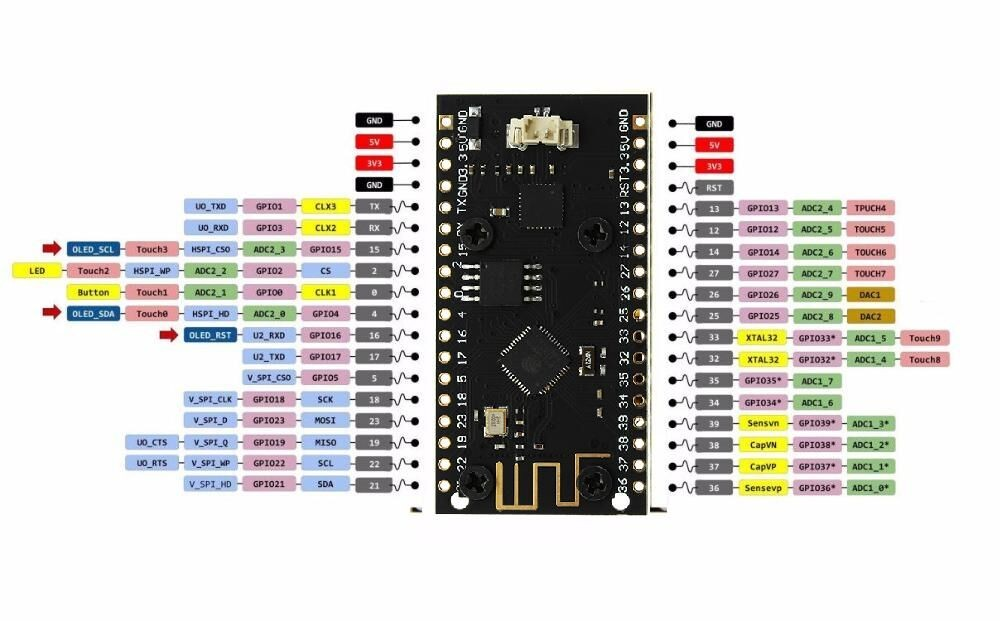

# HW info

## Board info
- [LILYGO® 4M Byte (32M bit )Pro ESP32 OLED V2.0 TTGO](http://www.lilygo.cn/prod_view.aspx?TypeId=50032&Id=1152) Manufacturer data sheet
- [TTGO LoRa32 OLED](https://hackaday.io/project/27791-esp32-lora-oled-module) usefull fan page.



## Sesnsor info
- [Adafruit BME280](https://cdn-shop.adafruit.com/datasheets/BST-BME280_DS001-10.pdf)

# Environment setup
- [Visual studio code](https://code.visualstudio.com/)
  - [Setting up Visual Studio Code for ESP32 IDF (FreeRTOS)](https://github.com/Deous/VSC-Guide-for-esp32) (Contains references and advices for older version of ESP-IDF)
- git

## Dependencies

### ESP 4.0 (beta 2)
- [Getting started ESP 4.0 (beta 2)](https://docs.espressif.com/projects/esp-idf/en/v4.0-beta2/get-started/index.html)
- [ESP-IDF](https://github.com/espressif/esp-idf)
```
    git clone -b release/v4.0 --recursive https://github.com/espressif/esp-idf.git
```
- [ESP-toolchain 4.0 beta 2 Installer](https://docs.espressif.com/projects/esp-idf/en/v4.0-beta2/get-started/windows-setup.html)
  - python 3.6+
  - cmake 3.13
  - mingw32-make 3.82

### Azure IoT SDK C for ESP
- [ESP Azure IoT SDK](https://github.com/espressif/esp-azure)
```
    git clone --recursive https://github.com/espressif/esp-azure.git
    git submodule update --init --recursive
```
and define environment variable named `AZURE_SDK_C_PATH` pointing to the above cloned directory.

- [Azure IoT Hub example](https://github.com/Azure/azure-iot-sdk-c/blob/350b51f5abaedc975dae5419ad1fa4add7635fd2/iothub_client/samples/iothub_ll_client_x509_sample/iothub_ll_client_x509_sample.c)

### BOOST
- [Getting started with boost](https://www.boost.org/doc/libs/1_71_0/more/getting_started/windows.html)
- Ensure environment variable *BOOST_ROOT* that contain path to unpacked boost distribution.

### Misc

- [Disable FreeRTOS static allocation API](https://esp32.com/viewtopic.php?t=3504) set in [sdkconfig.defaults](sdkconfig.defaults)
- [Quartz & Bitrate settings](https://docs.espressif.com/projects/esp-idf/en/latest/get-started/index.html#get-started-connect)

### Adafruit drivers
Use [ESP IoT Solution](https://github.com/espressif/esp-iot-solution/) clone it with all submodules
```
    git clone --recursive https://github.com/espressif/esp-iot-solution.git
    git submodule update --init --recursive
```
and define environment variable named `IOT_SOLUTION_PATH` pointing to the above cloned directory.

In (./CMakeLists.txt) we use a little dirty trick where we only define and use those drives we care of because the rest is highly incompatible with ESP-IDF 4.0 Beta2.

# Deprecated

## Arduino like
- clone with submodules https://github.com/espressif/esp-azure to c:/Users/z608328/AppData/Local/Arduino15/packages/esp32/hardware/esp32/1.0.1/libraries/esp-azure/
- Adafruit drivers for Arduino
  - Patch adafruit driver
